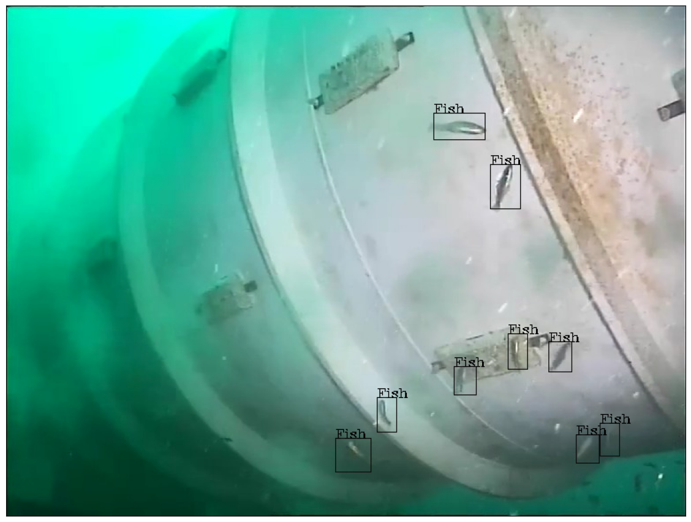
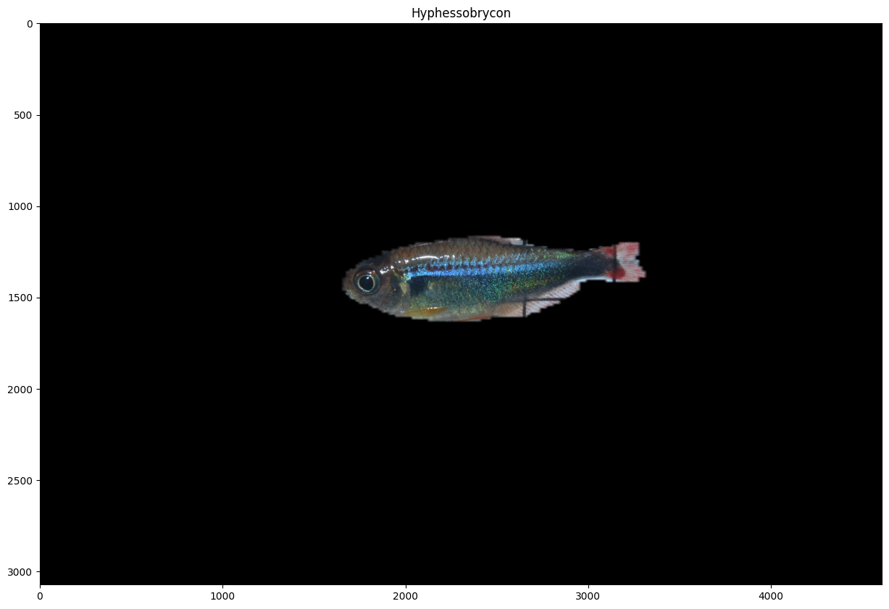
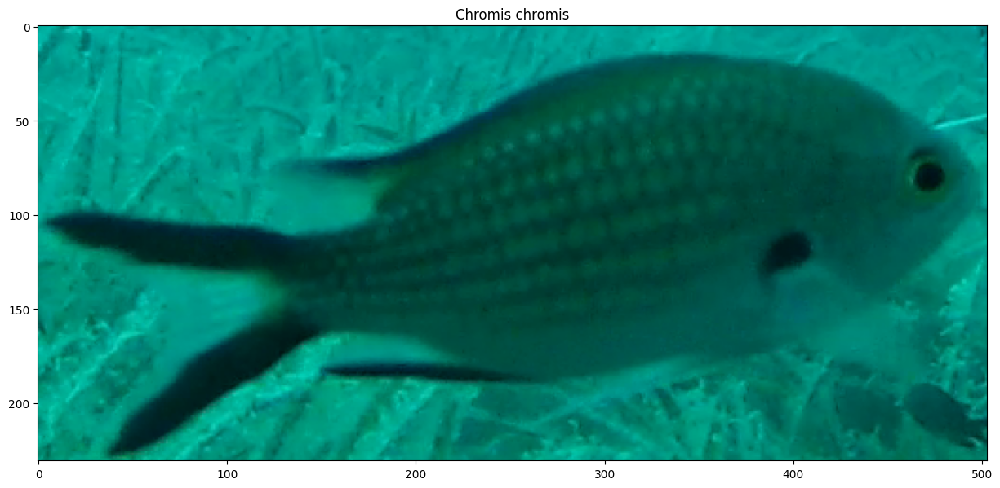

### Project Natick Underwater Video

~1k images of fish/squid w/bounding boxes
  
* 147 MB, downloadable via https from GitHub (<a href="https://github.com/Microsoft/Project_Natick_Analysis/releases/tag/annotated_data">download link</a>)
* Metadata in Pascal VOC format
* Categories: Fish, Squid
* Vehicle type: Fixed Camera on Structure
* Image information: 1118 RGB images (~5% images have FN annotations)
* Annotation information: 998  Bounding Box
* Code to render sample annotated image: <a href="./data_preview/visualise_natick.ipynb">visualise_natick</a>
  
  

  
  
### Application of a Deep Learning Image Classifier for Identification of Amazonian Fishes

~3k images of out-of-water fish w/species labels and segmentation masks
  
Dikow, Rebecca (2023). Data from: Application of a Deep Learning Image Classifier for Identification of Amazonian Fishes. Office of the Chief Information Officer. Collection. https://doi.org/10.25573/data.c.5761097.v1

* 315 MB, downloadable via https from Smithsonian (<a href="https://smithsonian.figshare.com/collections/Data_from_Application_of_a_Deep_Learning_Image_Classifier_for_Identification_of_Amazonian_Fishes/5761097">download link</a>)
* Metadata in csv format
* Categories: Fish Genus
* Vehicle type: Out-of-the-water Picture
* Image information: 3068 RGB images
* Annotation information: 3068  Masked image classification
* Code to render sample annotated image: <a href="./data_preview/visualise_amazonian_fish.ipynb">visualise_amazon_fish</a>
  
  

  
  
### Roboflow Fish Dataset

~1k images of fish w/bounding boxes
  
* 31 MB, downloadable via https from Roboflow (<a href="https://public.roboflow.com/object-detection/fish/1">download link</a>)
* Metadata in To choose format
* Categories: 26 Fish types (i.e. Shark, Tuna)
* Vehicle type: Underwater Pictures
* Image information: 1350 RGB images (the taxonomy is often inaccurate)
* Annotation information: 3142  Bounding Box
* Code to render sample annotated image: <a href="./data_preview/visualise_roboflow_fish.ipynb">visualise_roboflow_fish</a>
  
  

  
  
### The Fishnet Dataset

~163k bounding boxes on ~35k images of fish and people on fishing vessels
  
Kay, J., & Merrifield, M. (2021). The Fishnet Open Images Database: A Dataset for Fish Detection and Fine-Grained Categorization in Fisheries. Retrieved from https://arxiv.org/abs/2106.09178

* 36.41 GB, downloadable via https from The Nature Conservancy (<a href="https://www.fishnet.ai/">download link</a>)
* Metadata in csv format
* Categories: 34 Fish Types and Humans
* Vehicle type: On-deck cameras
* Image information: 143818 RGB images
* Annotation information: 549209  Bounding Box
* Code to render sample annotated image: <a href="./data_preview/visualise_fishnet.ipynb">visualise_fishnet</a>
  
  

  
  
### Croatian Fish

800 images of fish in 12 classes
  
* 130 MB, downloadable via https from Jena University (<a href="https://pub.inf-cv.uni-jena.de/pdf/Jaeger15:CFD">download link</a>)
* Metadata in XML format
* Categories: 12 Fish Species
* Vehicle type: BRUVS
* Image information: 794 RGB images
* Annotation information: 794  Cropped image classification
* Code to render sample annotated image: <a href="./data_preview/visualise_croatian_fish.ipynb">visualise_croatian_fish</a>
  
  

  
  
### The Brackish Dataset

~90 videos with bounding boxes on fish
  
* 181 MB, downloadable via browser from Kaggle (<a href="https://www.kaggle.com/datasets/aalborguniversity/brackish-dataset">download link</a>)
* Metadata in AAU, COCO, YOLO format
* Categories: Fish, Small Fish, Crab, Shrimp, Jellyfish, Starfish
* Vehicle type: Underwater Cameras in Brackish water
* Image information: 12444 RGB images (only the first 200 frames in 2019-03-19_17-07-53to2019-03-19_17-08-34_1.avi and first 100 frames in 2019-03-19_18-01-56to2019-03-19_18-02-13_1.avi are annotated. All other videos are fully annotated.)
* Annotation information: 35565  Bounding Box 
* Code to render sample annotated image: <a href="./data_preview/visualise_brackish_dataset.ipynb">visualise_brackish_dataset</a>
  
  

  
  
### Deep Vision Fish Dataset

Bboxed images of pelagic fish and associated segmentations
  
Vaneeda Allken, Shale Rosen (2020) Deep Vision fish dataset https://doi.org/10.21335/NMDC-551736490

* 367 MB, downloadable via https from Norvegian Marine Data Centre (<a href="https://metadata.nmdc.no/metadata-api/landingpage/01d102345aef4639f063a13ea20cd3f3">download link</a>)
* Metadata in csv format
* Categories: Economically important pelagic species
* Vehicle type: Picture from Fish Tank
* Image information: 1875 RGB images
* Annotation information: 4834  Bounding Box, Segmentation
* Code to render sample annotated image: <a href="./data_preview/visualise_deep_vision.ipynb">visualise_deep_vision</a>
  
  

  
  
